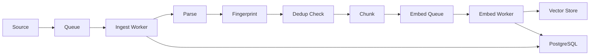

# DocFlow

A production-style document ingestion pipeline for RAG and knowledge systems.

## What this is

DocFlow is a robust document ingestion service for AI systems. It watches sources, parses documents, normalizes metadata, chunks intelligently, deduplicates, versions documents, embeds content, and writes clean records to a vector/database layer. It is the unglamorous machinery every serious RAG system needs.

## What problem it solves

Real RAG systems need robust data pipelines, not just "upload file." Every production RAG deployment eventually discovers that document ingestion is the hardest part:

- **Duplicate documents** pollute search results and waste embedding budget
- **Changed documents** need re-indexing without losing version history
- **Different file formats** require specialized parsers with consistent output
- **Chunk boundaries** directly impact retrieval quality
- **Metadata** must be normalized across heterogeneous sources
- **Processing failures** need retry logic, not silent data loss

DocFlow treats document ingestion as a proper engineering problem with queuing, fingerprinting, versioning, and observability.

## Why naive AI systems fail here

Most AI demos skip the hard parts:

| Problem | Naive approach | DocFlow approach |
|---|---|---|
| Deduplication | None - just re-upload | SHA-256 fingerprinting + similarity check |
| Versioning | Overwrite the old file | Full version history with diff support |
| Metadata | Whatever the file has | Normalized schema with language detection |
| Chunking | Split every 500 chars | Pluggable strategies: fixed, sentence, semantic, structural |
| Parsers | One-size-fits-all | Format-specific parsers with section extraction |
| Failure handling | Hope it works | Job tracking, retry logic, dead letter queue |

## Architecture



## Local quickstart

```bash
# Clone and enter the project
cd docflow

# Copy environment config
cp .env.example .env
# Edit .env with your OpenAI API key (or use sentence-transformers)

# Start all services
docker compose up -d

# Upload documents via API
curl -X POST http://localhost:8000/api/documents/upload \
  -F "files=@data/sample/company_handbook.md"

# Check processing status
curl http://localhost:8000/api/pipeline/status

# Or use the CLI
pip install -e .
docflow ingest --path data/sample/
docflow status
```

## Example workflow

```
1. Create a source
   POST /api/sources {"name": "company-wiki", "type": "local", "config": {"path": "./data/sample"}}

2. Upload documents
   POST /api/documents/upload (multipart form with files)

3. Watch processing
   GET /api/pipeline/status → shows jobs in progress

4. Check chunks
   GET /api/documents/{id} → returns document with chunk details

5. Query vector store
   The embedded chunks are now available for similarity search via the vector store
```

## Key design decisions

### Queue-based processing
Documents enter a Redis queue rather than being processed inline. This decouples upload speed from processing speed, enables worker scaling, and provides natural retry semantics.

### Content fingerprinting
Every document gets a SHA-256 fingerprint of its parsed text content (not the raw file). This detects true duplicates even when the same content arrives in different file formats.

### Document versioning
When a document's fingerprint changes, DocFlow creates a new version rather than overwriting. Previous versions remain queryable until explicitly pruned.

### Pluggable parsers
Each file format has a dedicated parser that produces a consistent `ParsedDocument` schema. Adding a new format means implementing the `BaseParser` interface.

### Strategy-based chunking
Chunking is not one-size-fits-all. DocFlow supports fixed-size, sentence-based, semantic, and structural chunking strategies, configurable per source or document type.

## Failure handling

- **Retry logic**: Failed jobs are retried up to 3 times with exponential backoff
- **Dead letter queue**: Permanently failed jobs are moved to a DLQ for inspection
- **Partial processing**: If embedding fails after chunking, chunks are preserved and embedding is retried independently
- **Status tracking**: Every job has a status (pending, processing, ready, error) with error details
- **Rollback**: Failed processing jobs can be retried or cleaned up via the API or CLI

## Testing strategy

- **Unit tests** per processor (parsers, chunking, dedup, versioning)
- **Integration tests** for the full pipeline (upload → parse → chunk → embed → store)
- **API tests** using FastAPI's TestClient
- **Fixtures** provide sample documents in multiple formats

```bash
# Run all tests
pytest

# Run specific test module
pytest tests/test_chunking.py -v

# Run with coverage
pytest --cov=docflow --cov-report=html
```

## Deployment notes

### Worker scaling
Run multiple worker instances to increase throughput. Each worker dequeues independently from Redis.

```bash
# Scale ingest workers
docker compose up -d --scale worker-ingest=3

# Scale embed workers
docker compose up -d --scale worker-embed=2
```

### Queue configuration
- `QUEUE_NAME`: Base queue name (default: `docflow`)
- `WORKER_CONCURRENCY`: Max concurrent jobs per worker
- `INGESTION_BATCH_SIZE`: Documents processed per batch

### Storage backends
- **Local**: Files stored on disk (default, good for development)
- **S3**: Files stored in object storage (production)

Set `STORAGE_BACKEND` to `local` or `s3` and configure the corresponding environment variables.

## Roadmap

- [ ] Webhook sources (receive documents via HTTP webhook)
- [ ] S3 integration (watch S3 buckets for new documents)
- [ ] Incremental updates (only re-process changed sections)
- [ ] Pipeline monitoring UI (real-time dashboard)
- [ ] Custom embedding models (bring your own model)
- [ ] Multi-language support (automatic language detection + routing)
- [ ] Document relationships (link related documents)

## What this project demonstrates

- Data pipeline design with queue-based processing
- Document lifecycle management with versioning and deduplication
- Production AI infrastructure patterns
- Clean service boundaries with dependency injection
- SQLAlchemy 2.0 with async support and vector extensions
- FastAPI with proper middleware, error handling, and type-safe schemas
