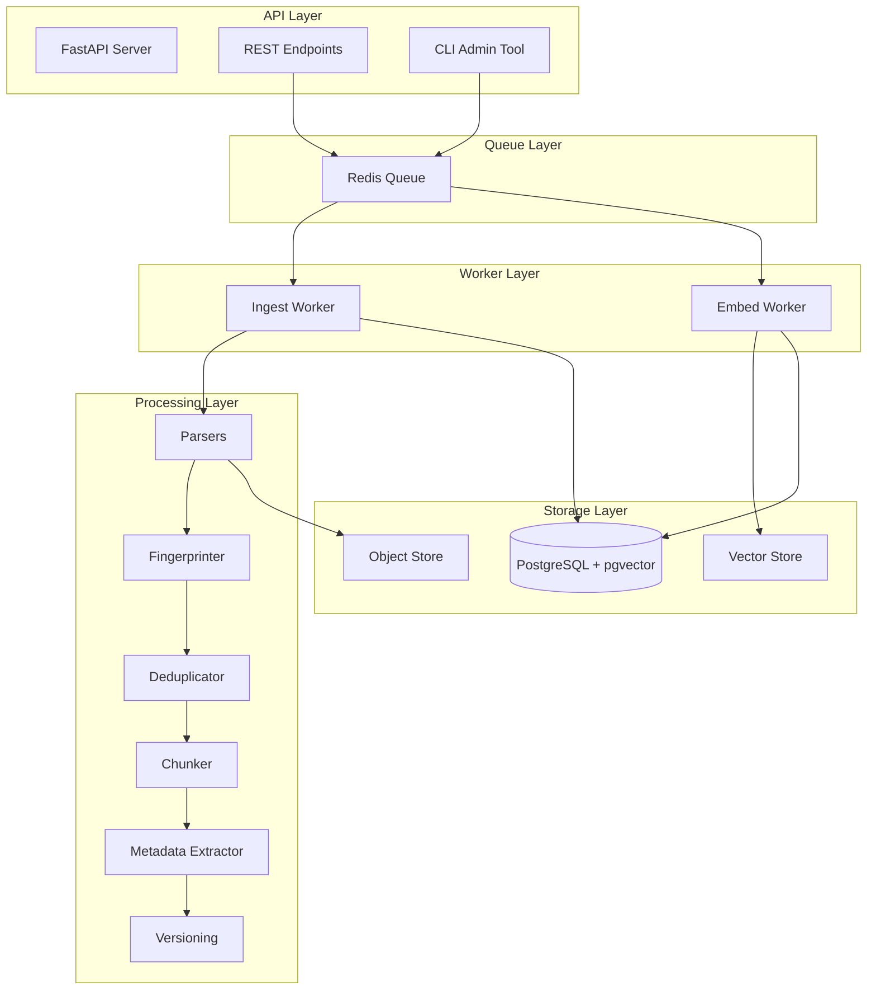
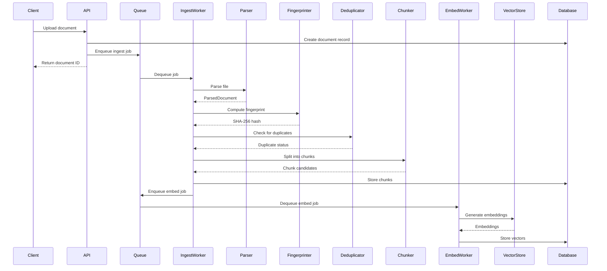

# Architecture

## System Overview

DocFlow is a document ingestion pipeline built around a queue-based worker architecture. Documents flow through discrete processing stages, each with clear input/output contracts and independent failure handling.

## Pipeline Stages

## Service Interactions

### API Service
- Accepts document uploads and source configurations
- Creates database records and enques processing jobs
- Returns processing status and query results

### Ingest Worker
- Dequeues documents from the ingest queue
- Runs the full parse → fingerprint → dedup → chunk pipeline
- Updates document status at each stage
- Enqueues embed jobs for successfully processed documents

### Embed Worker
- Dequeues embed jobs from the embed queue
- Generates embeddings using configured model
- Stores vectors in pgvector
- Handles rate limiting and batch processing

## Technology Choices

| Component | Technology | Rationale |
|---|---|---|
| API Framework | FastAPI | Async, type-safe, auto-docs |
| Database | PostgreSQL + pgvector | Relational + vector in one store |
| Queue | Redis | Fast, simple, widely supported |
| ORM | SQLAlchemy 2.0 | Async support, typed queries |
| Validation | Pydantic v2 | Fast, JSON Schema, settings |
| PDF Parsing | PyMuPDF | Fast, no external deps |
| HTML Parsing | BeautifulSoup | Robust, forgiving parser |
| Markdown | python-markdown + frontmatter | Metadata + rendering |
| Embeddings | OpenAI / sentence-transformers | Cloud or local options |
